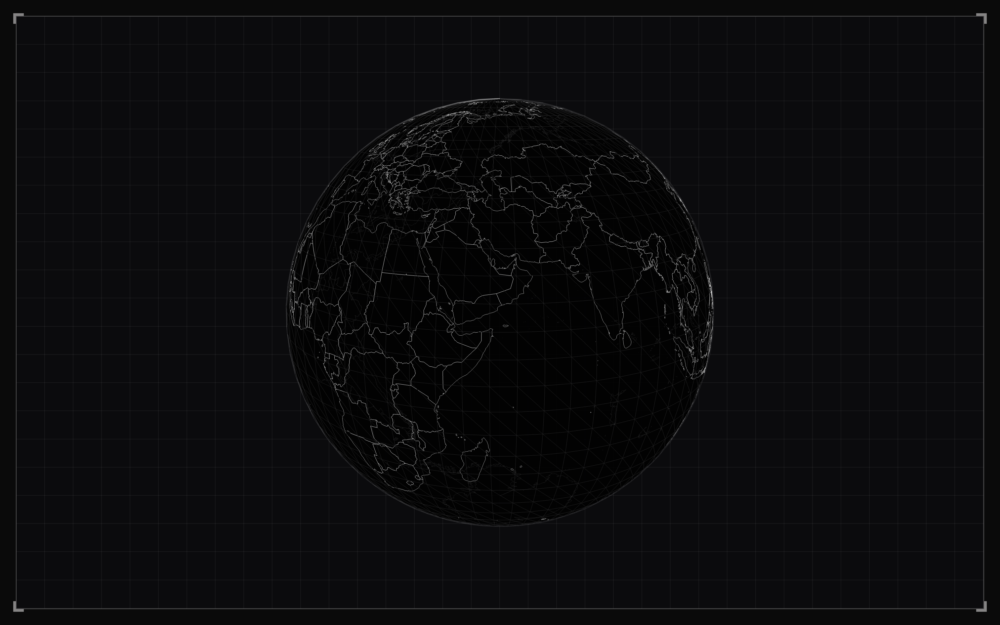

# Geo Globe Three

An interactive 3D globe visualization built with Next.js, React Three Fiber, and Three.js that displays world country boundaries using GeoJSON data.



## Tech Stack

- **Framework**: Next.js 15.4.5 with Turbopack
- **UI**: React 19 with TypeScript
- **3D Graphics**: Three.js, React Three Fiber, React Three Drei
- **Styling**: Tailwind CSS 4
- **Data**: GeoJSON world boundaries

## Getting Started

### Prerequisites

- Node.js 18+ or Bun
- Modern web browser with WebGL support

### Installation

1. Clone the repository:

```bash
git clone https://github.com/Code-Parth/geo-globe-three
cd geo-globe-three
```

2. Install dependencies:

```bash
bun install
# or
npm install
```

3. Start the development server:

```bash
bun run dev
# or
npm run dev
```

4. Open [http://localhost:3000](http://localhost:3000) in your browser.

## Scripts

- `dev` - Start development server with Turbopack
- `build` - Build for production
- `start` - Start production server
- `lint` - Run ESLint
- `lint:fix` - Fix linting issues and format with Prettier

## Components

### Globe Component

The main 3D globe visualization that:

- Loads world boundary data from GeoJSON
- Converts geographic coordinates to 3D sphere coordinates
- Renders country outlines as white lines on a dark sphere
- Supports both Polygon and MultiPolygon geometries

### Wrapper Component

A responsive layout wrapper that:

- Creates an adaptive grid overlay
- Provides corner markers for visual framing
- Maintains responsive design across different screen sizes

## Controls

- **Rotate**: Click and drag to rotate the globe
- **Zoom**: Scroll wheel to zoom in/out (limited between 4-12 units)
- **Pan**: Disabled for focused globe interaction

## Configuration

The globe can be customized by modifying parameters in `app/page.tsx`:

- **Sphere radius**: Adjust the `radius` parameter in `convertToSphereCoordinates`
- **Camera position**: Modify the `camera` prop in the Canvas component
- **Material colors**: Change sphere and line materials in the Globe component
- **Control limits**: Adjust min/max distance and speeds in OrbitControls

## Data Source

The project uses world boundary data from a GeoJSON file (`public/world.geojson`) that contains:

- Country polygons and multipolygons
- Detailed boundary coordinates
- Country metadata and properties

## Contributing

1. Fork the repository
2. Create a feature branch
3. Make your changes
4. Run `bun run lint:fix` to ensure code quality
5. Submit a pull request

## Deploy on Vercel

The easiest way to deploy your Next.js app is to use the [Vercel Platform](https://vercel.com/new?utm_medium=default-template&filter=next.js&utm_source=create-next-app&utm_campaign=create-next-app-readme) from the creators of Next.js.

Check out the [Next.js deployment documentation](https://nextjs.org/docs/app/building-your-application/deploying) for more details.
